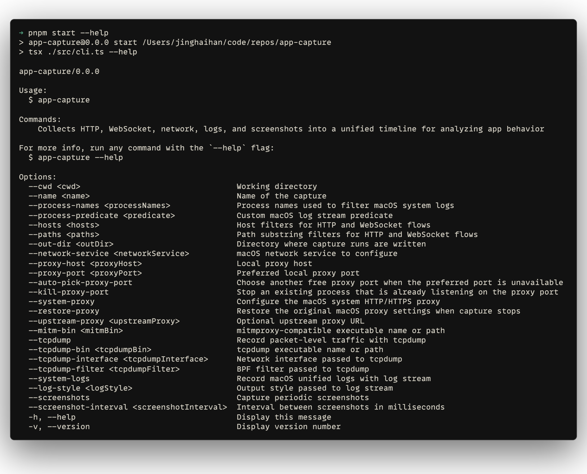

# app-capture

[![npm version][npm-version-src]][npm-version-href]
[![bundle][bundle-src]][bundle-href]
[![JSDocs][jsdocs-src]][jsdocs-href]
[![License][license-src]][license-href]

macOS-only CLI that saves each capture run in its own output directory: HTTP/WebSocket records, raw bodies, packet capture, macOS logs, and optional screenshots.

## Proposal

Use macOS as a capture workstation for investigating iOS and iPadOS app behavior. The goal is to record enough traffic, logs, and visual context to reconstruct API calls, WebSocket messages, payloads, timing, and user-flow steps from one capture run.

## Usage

<p align='center'>

</p>

Start capture first:

```sh
npx app-capture --name demo-capture \
  --network-service Wi-Fi \
  --proxy-port 8081 \
  --upstream-proxy http://127.0.0.1:7890 \
  --process-names DemoApp \
  --hosts api.example.com \
  --paths /api/ \
  --paths /v1/
```

Then use the target app normally. When you are done, return to the terminal and press `Control+C` to stop recording and restore proxy settings.

`--hosts` and `--paths` are traffic filters. Repeat them only when you need more filters.
`--process-names` filters macOS unified logs. Start the target app first, then find process names with Activity Monitor: search for the app, open its info panel, and use the exact Process Name value.

To find helper or extension processes, keep the app running and search by a word from the app name or bundle path:

```sh
ps -axo pid,comm | grep -i 'part-of-app-name'
```

Use the executable name from the `comm` column, without the path, as a `--process-names` value.

## Outputs

- `manifest.json`: run metadata, options, paths, proxy state, and final status. Generated by `app-capture`.
- `capture.log`: CLI events, child process commands, warnings, and shutdown flow. Generated by `app-capture`.
- `http.jsonl`: HTTP request/response timeline, headers, status codes, and body file links. Captured by `mitmdump` with the generated Python addon.
- `websocket.jsonl`: WebSocket message timing, direction, size, and body file links. Captured by `mitmdump` with the generated Python addon.
- `bodies/`: raw HTTP and WebSocket payload bytes for payload debugging. Captured by `mitmdump` with the generated Python addon.
- `network.pcap`: packet-level connectivity checks, retries, TLS handshakes, and non-proxy traffic clues. Captured by `tcpdump`.
- `app.log`: macOS unified logs for selected process names or predicates. Captured by `log stream`.
- `screenshots/`: optional visual state over time when UI context matters. Captured by `screencapture`.

## Dependencies

`app-capture` uses third-party and macOS tools:

- `mitmdump` from mitmproxy records HTTP and WebSocket flows. Its addon runs in Python.
- `tcpdump` records packet-level traffic and may ask for `sudo`.
- macOS provides `networksetup`, `log stream`, and `screencapture`.

With [Homebrew](https://github.com/Homebrew/brew):

```sh
brew install python mitmproxy
brew install tcpdump # optional; macOS also ships tcpdump
```

## License

[MIT](./LICENSE) License © [jinghaihan](https://github.com/jinghaihan)

<!-- Badges -->

[npm-version-src]: https://img.shields.io/npm/v/app-capture?style=flat&colorA=080f12&colorB=1fa669
[npm-version-href]: https://npmjs.com/package/app-capture
[npm-downloads-src]: https://img.shields.io/npm/dm/app-capture?style=flat&colorA=080f12&colorB=1fa669
[npm-downloads-href]: https://npmjs.com/package/app-capture
[bundle-src]: https://img.shields.io/bundlephobia/minzip/app-capture?style=flat&colorA=080f12&colorB=1fa669&label=minzip
[bundle-href]: https://bundlephobia.com/result?p=app-capture
[license-src]: https://img.shields.io/badge/license-MIT-blue.svg?style=flat&colorA=080f12&colorB=1fa669
[license-href]: https://github.com/jinghaihan/app-capture/LICENSE
[jsdocs-src]: https://img.shields.io/badge/jsdocs-reference-080f12?style=flat&colorA=080f12&colorB=1fa669
[jsdocs-href]: https://www.jsdocs.io/package/app-capture
